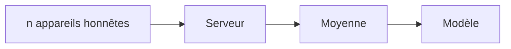
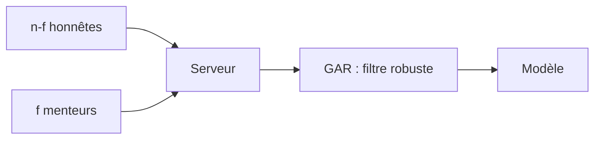

# Ma thèse en 180 secondes

Apprendre à plusieurs, sans se faire piéger par les menteurs

**Arthur Danjou** — IA Research Intern @ École Polytechnique

Chaire ATLAS (*Adversarial Techniques for Learning and AI Security*) — Centre de Mathématiques Appliquées (CMAP)

arthur.danjou@polytechnique.edu

<!--
Transition : "On ne peut pas rapatrier les données — alors entraînons là où elles sont : direction le fédéré."
-->

---
layout: default
---

# 1. Le fédéré : apprendre sans rapatrier

<v-clicks>

- **Centralisé (ChatGPT, Claude, Gemini) :** que tout le monde connaît — toutes les données rapatriées dans des datacenters, calculées au même endroit ($10^{12}$ = mille milliards de tokens d'entraînement)
- **Fédéré (Gboard, Siri, hôpitaux) :** calcul sur l'appareil, modèles médicaux entraînés entre hôpitaux sans jamais partager les dossiers — seules les corrections (les gradients) remontent
- **En maths :** centralisé $\min_\theta \frac{1}{N}\sum_{i=1}^N \ell(\theta; x_i, y_i)$ (une seule machine voit tout) → fédéré $\min_\theta \frac{1}{n}\sum_{k=1}^n L_k(\theta)$, où $L_k$ est l'erreur du modèle sur les données du participant $k$ — chacun calculant son gradient local

</v-clicks>

<!--
Transition vers les byzantins : "Rapide, privé, élégant — mais tout repose sur une hypothèse fragile : chaque participant joue franc-jeu. Et si l'un d'eux ment sur son gradient ?"
-->

---
layout: default
---

# 2. Les byzantins : 1 menteur casse la moyenne

Schéma fédéré honnête : $n$ appareils, le serveur moyenne.

- **Moyenne :** $\bar{g} = \frac{1}{n}\sum g_i$, point de rupture 0 — un +100 au milieu des +1 donne +11, le pas part de travers

Schéma avec byzantins : des menteurs se glissent parmi les honnêtes — la moyenne casse, on la remplace par une GAR (règle d'agrégation robuste).

<v-clicks>

- **Menace :** $f$ workers sur $n$, omniscients et en collusion — ils optimisent contre la défense : SignFlip (envoyer $-g$), ALIE (« A Little Is Enough », furtif — envoyer $\mu - z\sigma$ par coordonnée)
- **Défenses (GAR) :** médiane coordonnée (rupture $1/2$) et Krum $g_{agg} = \arg\min_i \sum_{i \to j} \|g_i - g_j\|^2$ — on élit le plus consensuel

</v-clicks>

<!--
ALIE: l'attaquant observe les gradients honnêtes et calcule par coordonnée leur moyenne mu et leur écart-type sigma. Il envoie mu - z*sigma avec z petit (1-2) : chaque coordonnée semble normale, les filtres par distance ne voient rien, mais l'effet collectif pousse la moyenne à l'opposé du vrai gradient. D'où "a little is enough".

Krum: Chaque worker reçoit un score = la somme des distances au carré vers ses voisins les plus proches. Le score le plus bas gagne, et c'est son gradient — un vrai gradient, pas une moyenne — qui fait avancer le modèle. Le menteur isolé à +100 n'a aucun voisin : son score explose, il perd l'élection à tous les coups.

Transition : "Les GAR marchent — à condition que tous les honnêtes voient à peu près les mêmes données. Et quand ce n'est pas le cas ?"
-->

---
layout: default
---

# 3. Non-i.i.d. : le faux positif qui tue les GAR

<v-clicks>

- **IID :** tout le monde voit la même distribution — hypothèse cachée de Krum et compagnie
- **Non-i.i.d. :** chacun voit une distribution différente — $Dataset_1 \neq Dataset_2 \neq Dataset_3$
  - $\theta^\star_k = \arg\min_\theta L_k(\theta)$ : l'optimum des données du participant $k$
  - $\theta^\star_{\mathrm{global}} = \arg\min_\theta \frac{1}{n}\sum_k L_k(\theta)$ : l'optimum qui minimise l'erreur moyenne sur tout le monde
  - Non-i.i.d. ⇒ $\theta^\star_{\mathrm{global}} \neq \theta^\star_k$ : les optima se séparent, et les gradients honnêtes avec eux
- **Le drame :** Krum global confond l'honnête atypique avec un menteur — l'expert rare se fait exclure

</v-clicks>

<!--
Transition : "Donc un seul modèle global plus une seule GAR globale, c'est le double échec. Il faut découper le problème — et c'est exactement ce que fait le MoE : des experts à la place des clients, et un routeur qui répartit chaque cas vers le bon expert."
-->

---
layout: default
---

# 4. Mon idée : une GAR sur le routeur

<v-clicks>

- **MoE en 10 secondes :** au lieu d'un seul gros modèle, des petits experts spécialisés + un routeur qui lit la question, l'envoie aux 1-2 meilleurs experts sur 8 et les pondère (Mixtral 8x7B)

</v-clicks>

<v-clicks>

- **L'idée :** mes prédécesseurs ont remplacé la moyenne par une GAR dans le fédéré classique — dans un MoE fédéré, le routeur est le nouveau point de passage : l'empoisonner, c'est rediriger tout le trafic. Donc, une GAR sur le routeur.
- **Protocole :** 8 experts synthétiques, $f = 1, 2, 3$ attaquants, duel Krum global (les prédécesseurs) vs GAR sur le routeur (moi)

</v-clicks>

<!--
Détail pour les questions : le routeur est entraîné de façon fédérée, ses gradients remontent au serveur — la GAR (Krum) filtre ces gradients. Variante de secours : une GAR par expert, l'attaque reste alors coincée sur un seul expert.
-->
